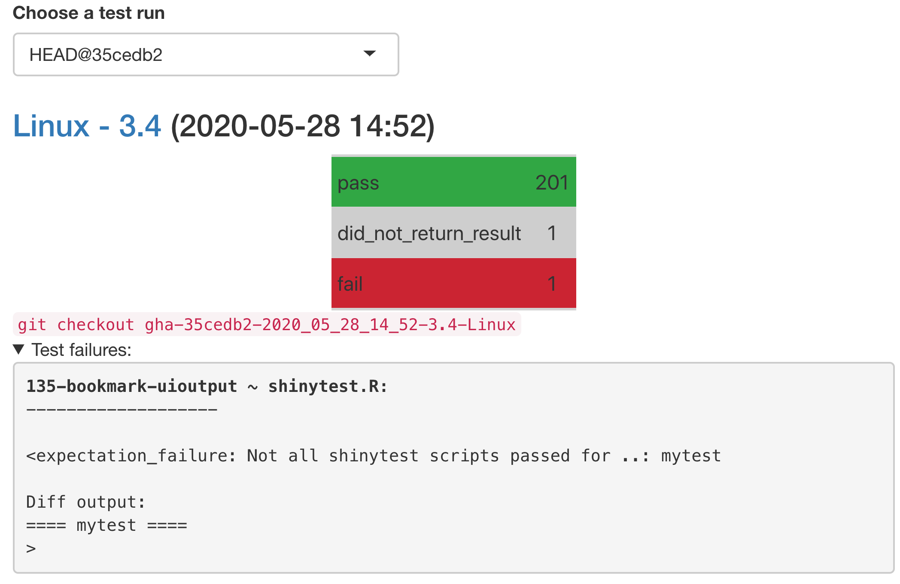

# shinycoreci-apps

<!-- badges: start -->
[](https://github.com/rstudio/shinycoreci-apps/actions?query=workflow%3ArunTests)
[](https://github.com/rstudio/shinycoreci-apps/actions?query=workflow%3ADocker)
[](https://github.com/rstudio/shinycoreci-apps/actions?query=workflow%3ADeploy)
[](https://github.com/rstudio/shinycoreci-apps/actions?query=workflow%3ATrim%20Old%20Branches)

<!-- badges: end -->

Tools for manual and automated testing of shiny apps.

## Running manual tests

First, clone the shinycoreci-apps repo. Next, install [`remotes::install_github("rstudio/shinycoreci")`](https://github.com/rstudio/shinycoreci).  You may need to add your `GITHUB_PAT` to your R Environ file (See `?usethis::edit_r_environ` and `?usethis::browse_github_pat`)

* [RStudio IDE](https://rstudio.com/products/rstudio/download/#download) - `shinycoreci::test_in_ide()`
* [RStudio Cloud](http://rstudio.cloud) - `shinycoreci::test_in_ide()`
* [RStudio Server Pro](https://colorado.rstudio.com) - `shinycoreci::test_in_ide()`
* R Terminal / R GUI - `shinycoreci::test_in_browser()`
* (Any) Web Browser - `shinycoreci::test_in_browser()`
* [shinyapps.io](http://shinyapps.io) - `shinycoreci::test_in_shinyappsio()`
* [RStudio Connect](http://beta.rstudioconnect.com) - `shinycoreci::test_in_connect()`
* SSO - `shinycoreci::test_in_sso(release = "bionic")`
  > will require docker login. Run `docker login` in the terminal
* SSP - `shinycoreci::test_in_ssp(release = "centos7")`
  > will require docker login. Run `docker login` in the terminal

All testing functions may be run from within the IDE (except for R Terminal / R Gui).

#### IDE Example

```r
remotes::install_github("rstudio/shinycoreci")
# Sitting at the root folder of the rstudio/shinycoreci-apps repo
shinycoreci::test_in_ide()
```


## View and manage automated test results

To view and manage test results, first make sure your working directory is the `shinycoreci-apps` repo.

Use `shinycoreci::view_test_results()` to obtain an overview of the most recent test runs (it should prompt a **shiny** app that looks similar to this):

<div align="center">
  
</div>

If you see failures that indicate a difference in **shinytest** baselines (as above), you may need to just view and approve the differences.

To obtain and correct the shinytest differences, use `shinycoreci::fix_all_gha_branches()`. This function will walk you through the steps needed to update all `shinytest` failures and merge in the latest information from each `gha-` branch.  To approve the differences, click on the "Update & click" button. To reject the differences, click on "Quit" button.


In the event that all testing failures can not be addressed by updating shinytest baselines, have a look at the [GHA actions](https://github.com/rstudio/shinycoreci-apps/actions) build log and keep the following troubleshooting tips in mind:

### Troubleshooting test failures

1. Failures on old versions of R

If a testing app passes on recent version(s) of R, but fails in a suprising way on old R version(s), it may be due to an old R package version. In that case, modify the tests to run only if a sufficient version of the relevant package is available ([for example](https://github.com/rstudio/shinycoreci-apps/blob/5691d1f4/apps/145-dt-replacedata/tests/shinytest.R)).

2. Other failures that can't replicated locally

Other surprising failures are often the result of timing issues (which can be difficult, if not impossible, to replicate locally). If your testing app uses dynamic UI and/or doesn't have proper input/output bindings, **shinytest** probably needs to know how long to wait for value(s) to update (in this case, use `waitForValue()`, [for example](https://github.com/rstudio/shinycoreci-apps/blob/5691d1f4/apps/021-selectize-plot/tests/shinytest/mytest.R#L10-L11)). Somewhat similarly, when checking DOM values with **shinyjster**, you may need to wait for an update to DOM element(s) before checking value(s), in which case you can write a recursive function that keeps calling itself until the DOM is ready ([for example](https://github.com/rstudio/shinycoreci-apps/blob/5691d1f4/apps/187-navbar-collapse/app.R#L24-L34)).

## Contribute a testing app

When contributing a testing app, try to do the following:

* Capture all the functionality with automated tests.
  * Also, where possible, write "light-weight" tests (that is, try and avoid **shinytest** where possible since they are prone to false positive differences and thus have a maintenance cost).
  * If the app does need manual testing, flag the testing app for manual testing with `shinycoreci::use_manual_app()`.
* Add a description to the app's UI that makes it clear what the app is testing for.

Note that **shinycoreci** supports 3 different testing frameworks, and provides helper functions to provide the file scaffolding for each case (that is, `use_tests_shinytest()`, `use_tests_shinyjster()`, `use_tests_testthat()`)

1. **shinytest**: primarily useful for taking screenshots of shiny output binding(s) (before or after interacting with **shiny** input bindings). [See here](https://github.com/rstudio/shinycoreci-apps/blob/5691d1f/apps/001-hello/tests/shinytest/mytest.R) for an example (note that `shinytest::recordTest()` can be used to generate shinytest testing scripts).

2. **shinyjster**: primarily useful for asserting certain expectations about the DOM (in JavaScript). [See here](https://github.com/rstudio/shinycoreci-apps/blob/5691d1f/apps/001-hello/app.R#L37-L61) for an example (note that `shinyjster::shinyjster_js()` needs to be placed in the UI and `shinyjster::shinyjster_server(input, output)` needs to be placed in the server).

3. **testthat**: primarily useful in combination with `shiny::testServer()` to test server-side reactive logic of the application.
  * [See here](https://github.com/rstudio/shinycoreci-apps/blob/5691d1f4/apps/001-hello/tests/testthat/tests.R#L4) for an example.
  * Call `shinycoreci::use_tests_testthat(app_dir)` to provide the file scaffolding necessary to run the **testthat** tests


## Pruning old git branches

To help us store and manage the test results, git branches are automatically created for each test run. These branches are automatically removed on GitHub after 1 week of no activity, but you may want to periodically remove them on your local machine as well:

```bash
git fetch --prune
```

## What workflows are available?

This repo contains several [GitHub Actions](https://github.com/features/actions) workflows:

* [**runTests:**](https://github.com/rstudio/shinycoreci-apps/actions?query=workflow%3ArunTests) Run the automated tests (via `shiny::runTests()`).
* [**Docker:**](https://github.com/rstudio/shinycoreci-apps/actions?query=workflow%3ADocker) Create all SSO and SSP docker images
* [**Deploy**](https://github.com/rstudio/shinycoreci-apps/actions?query=workflow%3ADeploy): Deploy all testing apps to [shinyapps.io](shinyapps.io) and [beta.rstudioconnect.com](https://beta.rstudioconnect.com)

The **runTests** workflow runs automatically on every code change to `shinycoreci-apps` as well as every night (around midnight UTC). The other workflows may be triggered via `shinycoreci::trigger_docker()` and `shinycoreci::trigger_deploy()`

### Managing R package dependencies

"Core" `shinycoreci-apps` R package dependencies come from **shinycoreci**'s [DESCRIPTION file](https://github.com/rstudio/shinycoreci/blob/master/DESCRIPTION); and so, that file may be modified to test different versions of different packages in the shinyverse.

Application-specific R package dependencies are automatically inferred (and installed at run-time) using `renv::dependencies()`.

> Note: `renv::dependencies()` are taken from CRAN, not GitHub Remotes.
