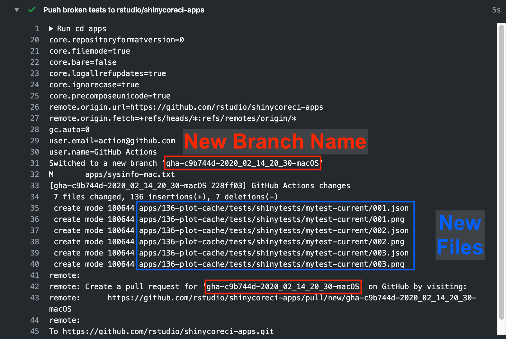

# shinycoreci-apps

<!-- badges: start -->
[](https://github.com/rstudio/shinycoreci-apps/actions?query=workflow%3Ashinytest)
[](https://github.com/rstudio/shinycoreci-apps/actions?query=workflow%3Ashinyjster)
[](https://github.com/rstudio/shinycoreci-apps/actions?query=workflow%3Atestthat)
<!-- badges: end -->

Test applications and workflows for Shiny R packages.

There are three main workflows:
* [**shinytest:**](https://github.com/rstudio/shinycoreci-apps/actions?query=workflow%3Ashinytest) Test applications using [`rstudio/shinytest`](https://github.com/rstudio/shinytest)
* [**shinyjster:**](https://github.com/rstudio/shinycoreci-apps/actions?query=workflow%3Ashinyjster) Test applications using [`schloerke/shinyjster`](https://github.com/schloerke/shinyjster)
* [**testthat**](https://github.com/rstudio/shinycoreci-apps/actions?query=workflow%3Atestthat): Test applications using [`rstudio/testthat`](https://github.com/rstudio/testthat) via INTEGRATION_TESTING_LINK


## Testing Environments

[**`shinytest`**](https://github.com/rstudio/shinytest)
* Local App Driver testing (w/ headless Phantom.js browser)
* Apps have tests in `./APP/tests/shinytests` directory
* Functions:
  * `shinycoreci::test_shinytest()`

**`testthat`**
* Local R testing (R environment)
* Functions:
  * `shinycoreci::test_testthat()`

[**`shinyjster`**](https://github.com/schloerke/shinyjster)
* Primarily a JavaScript library
* Test javascript code is added in `app.R`
* `shinyjster` is currently intended for testing apps specifically created to test something in particular. It is not something we suggest be used to test most applications. This positions `shinyjster` differently than `shinytest` and the forthcoming _integration testing_ feature of Shiny.
* Functions:
  * Local Headless
    * Chrome: `shinycoreci::test_shinyjster(browser = "chrome")`
    * ~~Firefox: `shinycoreci::test_shinyjster(browser = "firefox")~~
    * ~~Internet Exploreer: `shinycoreci::test_shinyjster(browser = "ie")~~
    * ~~Safari: `shinycoreci::test_shinyjster(browser = "safari")~~
  * ~~Local IDE~~
  * ~~Connect~~
  * ~~SSO/SSP~~
  * ~~[rstudio.cloud](http://rstudio.cloud)~~
    * ~~Log into a session, then RUN LOCAL IDE~~


## Usage

```r
# (Install `shinycoreci` once per R session)
remotes::install_github("rstudio/shinycoreci")

# Sitting at the root folder of the rstudio/shinycoreci-apps repo
shinycoreci::test_shinytest()
shinycoreci::test_shinyjster()
shinycoreci::test_testthat()
```

This GitHub repo works in concert with [`rstudio/shinycoreci`](https://github.com/rstudio/shinycoreci)

Each of the major `test_*()` methods will (by default) ask a [Spreadsheet of Apps](https://docs.google.com/spreadsheets/d/1jPWPNmSQbbE8E6KS5tXnm5Jq7r01GaOCCE1Vvz5e9a8/edit#gid=0) to determine which apps to test.  `test_testthat()` will inspect all apps in the supplied directory inspecting for a `tests/testthat.R` file.

New apps **must be added** to the [spreadsheet](https://docs.google.com/spreadsheets/d/1jPWPNmSQbbE8E6KS5tXnm5Jq7r01GaOCCE1Vvz5e9a8/edit#gid=0).  Check the appropriate boxes to trigger respective workflows.


### Diagnosing `shinytest` problems posted by GitHub Actions



When `shinytest` fails, the workflow will capture the failed test artifacts and push them to a new branch of `rstudio/shinycoreci-apps`.  This branch will be in the form of `gha-SHA-DATE-OS`.

* `SHA` - The git sha of the commit that triggered the workflow
* `DATE` - The year, month, day, hour, and minute with the format `YEAR_MO_DY_HR_MN`
* `OS` - One of `macOS`, `Windows`, or `Linux`.

#### Steps fix broken `shinytest` apps

The following manual bash steps might be useful in resolving `shinytest` problems.

```bash
#!/usr/bin/bash
# Sitting at the root folder of the rstudio/shinycoreci-apps repo

git checkout master
git pull
git checkout BROKEN_BRANCH_NAME

# Accept or reject results
Rscript -e "shinycoreci::view_test_diff()"

# If any apps need to be fixed, fix them and re-run tests for those apps.

# At this point, need to delete any *-current directories that remain.
find . -name "*-current"
# If any are found, delete them
rm -rf XXXXXX-current

# Add deleted files to git
git add -u .
# Make sure that the right files are staged. No *-current directories!
git status
git commit -m "MESSAGE"

# Merge the branch into master
git checkout master
git merge BROKEN_BRANCH_NAME
git push
git branch -D BROKEN_BRANCH_NAME
```

# FAQ

### Workflows and Actions

[**GitHub Actions**](https://github.com/features/actions) is a GitHub service for initiating processes implemented as _workflows_. Workflows are YAML files that indicate a series of programmatic steps to perform.

The workflows that test the Shiny ecosystem are stored in the [`shinycoreci-apps` repo in the .github directory](https://github.com/rstudio/shinycoreci-apps/tree/master/.github/workflows), and their status can be viewed on the [**Actions**](https://github.com/rstudio/shinycoreci-apps/actions) tab of the GitHub website.

Each workflow corresponds to a particular set of tests that apply one particular type of test. `shinytest`, `shinyjstr`, and `testthat` testing strategies each have a corresponding workflow, stored in the `shinycoreci-apps` repo.

All workflows do the following
* Prepare a virtual machine by installing R and required package dependencies
* Eventually gets to a point where it executes shinytest or some other type of test on each example app.
* After tests for all apps have been run, the workflow completes. If the workflow completes successfully, the workflow as a whole is considered "successful" and GitHub displays its run status with a green checkmark.
* If any errors are encountered, the workflow will be considered to have failed, as indicated by a red `X` in the GitHub UI.

When `shinytest` runs a test, it creates png screenshots of what the app currently looks like.

If new screenshots differ from those created previously, the user is presented with the option to accept new screenshots as the correct ones.

### Steps to initiate tests

After cloning the repo, you can initiate a test run either by making a change to an application and pushing the commit, or by using the `shinycoreci::trigger()` function.

> Note: It’s not currently possible to initiate a workflow and for that workflow to test a subset of the apps (as opposed to all of them, which is the current default). However, it’s not obvious what the advantage of this would be, considering most of the time spent in the workflow is setup.


### Dependencies

The [`shinycoreci` dependencies](https://github.com/rstudio/shinycoreci/tree/readme#installation) are listed in the DESCRIPTION file. Many of the dependencies are on latest packages from GitHub, and so its set of dependencies is constantly moving forward. This is intentional; it is an attempt to be notified as early as possibly by failures or incompatibilities that might be introduced by new dependencies.

The `shinycoreci-apps` dependencies are automatically inferred using `renv::dependencies()` every time a workflow runs. This step runs after the `shinycoreci` package is installed.

> Note: `renv::dependencies()` are taken from CRAN, not GitHub Remotes.
